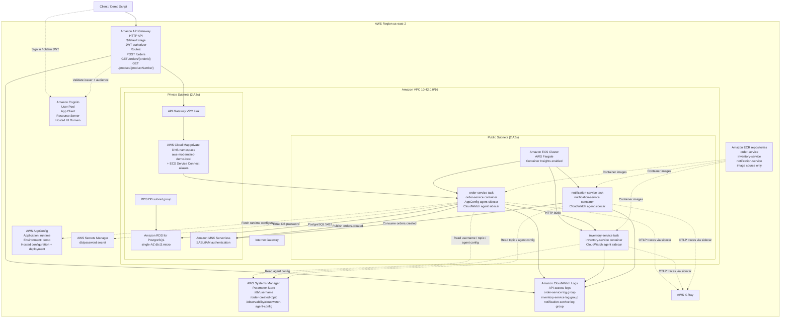
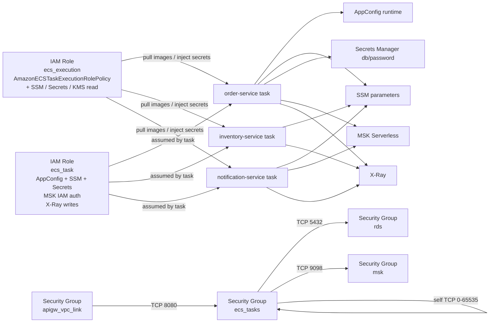

# AWS Architecture Diagram

This diagram is derived from the current Terraform in `infra/terraform/`. It reflects the deployed topology as-is, including ECS tasks in public subnets, API Gateway VPC Link ENIs in private subnets, and the current supporting AWS services used by the three Spring Boot applications.

## Runtime Topology

## Access, IAM, And Security Relationships

## Component Coverage

The diagrams above cover the AWS components currently present in Terraform and runtime configuration. To keep the diagrams readable, some low-level Terraform resources are grouped under their parent service or platform box.

- API Gateway HTTP API, JWT authorizer, stage, routes, and VPC Link
- Cognito user pool, app client, resource server, and hosted UI domain
- VPC, internet gateway, public/private subnets, route tables, route table associations, and the current placement of compute and data services
- ECS cluster, Fargate services, Cloud Map service registrations, Service Connect aliases, and Cloud Map namespace
- `order-service`, `inventory-service`, and `notification-service`
- AppConfig agent and CloudWatch agent sidecars
- CloudWatch Logs, Container Insights, and X-Ray
- RDS PostgreSQL and DB subnet group
- MSK Serverless
- AppConfig application, environment, configuration profile, hosted configuration version, deployment strategy, and deployment
- SSM Parameter Store and Secrets Manager, including the generated secret version for the database password
- ECS execution/task IAM roles, policy attachment, inline policies, and the security groups defined in `security.tf`
- ECR as the image source consumed by the deployment scripts
